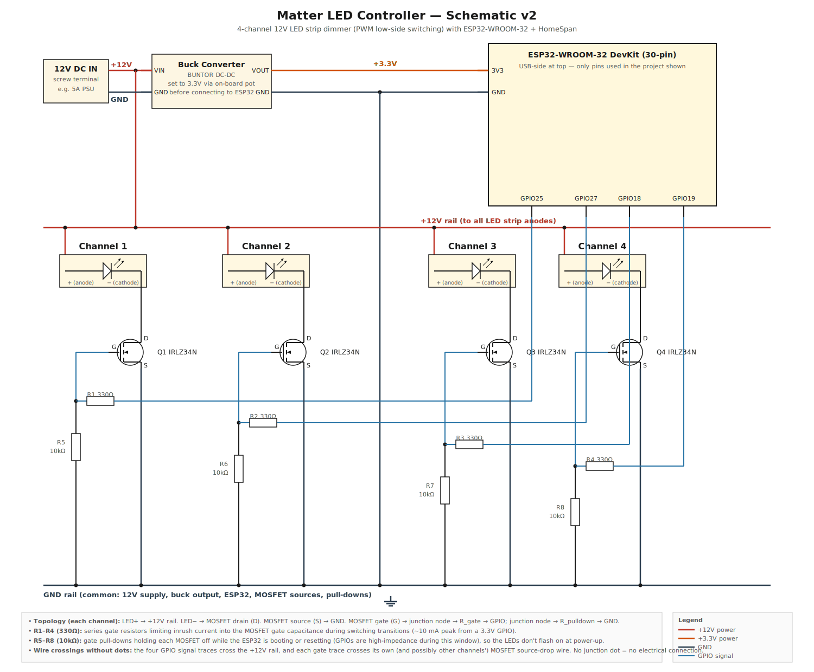
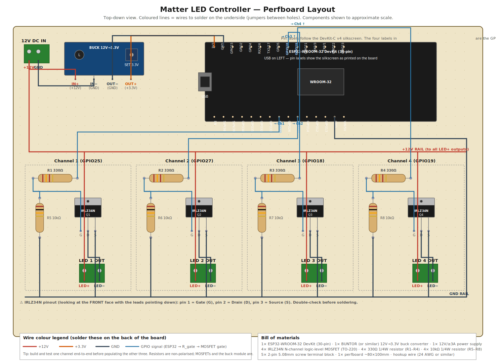

# Matter LED Controller

## The problem

I bought a [Shelly Plus RGBW PM](https://www.amazon.co.uk/dp/B0CXN2B9RS) device to power four LED strips in my rennovated home office. The LED strips are [Mini Warm White Neon Flex 3000K 12V 6x12mm 120LEDs/m](https://www.ukledlights.co.uk/products/led-neon-flex-warm-white-dc-12v-120leds-m-ip65-waterproof-6x12mm) ones and I absolutely love them.

The problem is the in-built Shelly firmware supports dimming of the LED strips individually, but isn't Matter compatible. That's a problem for me, I'm fully in the Apple ecosystem so I need the strips to be controllable via Apple Home. Using a cheap Matter-compatible smart plug I couldn't turn them on or off, but then I'd have to use the Shelly Web UI to control dimming after they were turned on.

My office doubles as a home automation playground, so I use an Aqara FP2 presence sensor to turn all the lights on automatically. I'd like to be able to have different brightnesses for all lights during the day and the evening. So this was a non-starter.

My next step was to install custom firmare [Shelly-HomeKit](https://github.com/mongoose-os-apps/shelly-homekit). This allows control for each strip individually over Matter/HomeKit, but not dimming.

So there has to be a better way. As a geek, with a GCSE (secondary school level) certificate in Electronics from 35 years ago... "How hard can it be?" - which lead me to ESP32 dev boards, HomeSpan and other fun topics.

## The electrical design

The circuit design is as below, I'll give some explanation afterwards because I'm not an expert and only recently started re-learning this stuff...



[View full screen ↗](https://raw.githubusercontent.com/andyjeffries/matter-led-controller/master/doc/schematic-v2.svg)

I'm using 12V light strips with a 12V power source. There are multiple +12V points on the schematic to keep the design simple without crossing over wires. The power is fed in to a [BUNTOR  DC-DC Buck Converter](https://www.amazon.co.uk/dp/B0F5W7C4KX) to convert this down to the ideal 3.3V that the ESP32 requires. The 12V supply is also connected to the LED strip anode; the LED strip cathode connects to the Drain of an MOSFET, with its Source connected to GND.

The LED strip is switched on/off (and dimmed via PWM) by an IRLZ34N MOSFET (Logic-level N-channel, supports PWM for dimming) which uses the 3.3V signal from a GPIO pin on the ESP32 to allow current to flow through to GND.

There is a 10kΩ pull-down resistor added from ground to the Gate of the MOSFET to ensure that static doesn't allow current to flow through the MOSFET, and to keep the gate held low while the ESP32 is booting (so the LEDs don't flash on at power-up). There's also a 330Ω resistor connected between the GPIO pin and the Gate of the MOSFET to limit the inrush current into the gate capacitance during switching.

The schematic shows all four channels explicitly, wired to GPIO25, GPIO27, GPIO18 and GPIO19 respectively (these are non-strapping pins on the ESP32-WROOM-32 and match the pins in [`src/main.cpp`](src/main.cpp)).

### Board layout

Here is a top-down view of how the components sit on a piece of perfboard, with each colour indicating a wire to solder on the underside of the board:



[View full screen ↗](https://raw.githubusercontent.com/andyjeffries/matter-led-controller/master/doc/board-layout-v1.svg)

## Development

This project uses [PlatformIO](https://platformio.org/) via the CLI. Install it if you haven't already.

On macOS:

```sh
brew install platformio
```

On Arch-based Linux:

```sh
sudo pacman -S platformio-core platformio-core-udev python-pip
```

(`platformio-core-udev` installs the udev rules needed for serial uploads without root; `python-pip` is required by PlatformIO when it bootstraps its toolchain packages.)

Or via pip on any platform:

```sh
pip install platformio
```

A `Makefile` wraps common commands:

| Command | Description |
|---------|-------------|
| `make` | Build the project |
| `make upload` | Flash firmware to the ESP32 |
| `make monitor` | Open serial monitor (115200 baud) |
| `make flash` | Upload + open serial monitor in one step |
| `make clean` | Remove build artifacts |
| `make format` | Format source code with clang-format |
| `make devices` | List connected serial devices |

If PlatformIO doesn't auto-detect the right port, override it:

```sh
make flash PORT=/dev/cu.usbserial-XXX
```

## Software design

[HomeSpan](https://github.com/HomeSpan/HomeSpan) is an open-source framework that lets ESP32 devices act as native Apple HomeKit accessories — no bridges or extra apps required. It implements Apple’s HAP (HomeKit Accessory Protocol) over Wi-Fi and optionally Bluetooth, exposing your device directly to the Apple Home app.

### How It Works Internally

At a high level:

* HomeSpan emulates a HomeKit accessory on the ESP32.
* Each "accessory" exposes one or more services (e.g. LightBulb, Switch, TemperatureSensor).
* Each service exposes one or more characteristics (e.g. On, Brightness, Hue).
* HomeKit on your iPhone communicates with those characteristics — sending and receiving values in real time.
* When you toggle a light in the Home app, HomeKit sends a command directly to the ESP32’s HomeSpan service, which then runs the code in `update()` to physically change the LED output.
